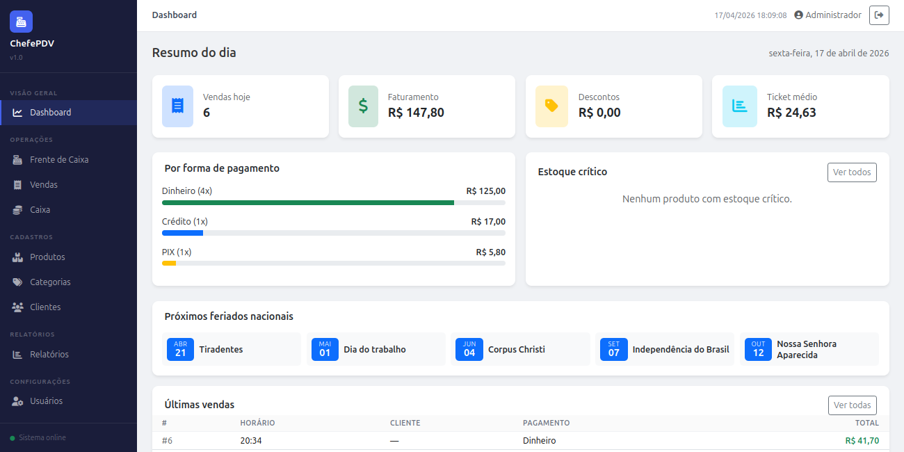
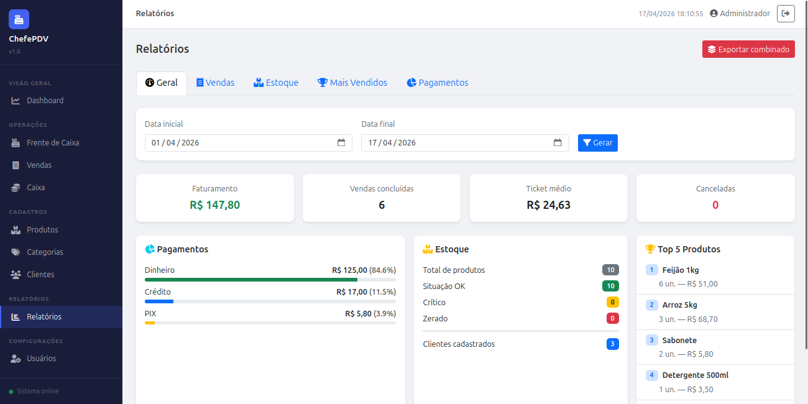

# ChefePDV


> Sistema de ponto de venda em PHP puro, sem framework: controle de caixa, estoque com baixa atômica, relatórios e gestão de acesso por perfil.

Grande parte do varejo brasileiro ainda roda em sistemas legados de PHP puro, sem framework, com jQuery no frontend. Quis entender esse modelo de ponta a ponta e construir algo nesse perfil, mas com arquitetura em camadas, segurança real e código que se sustenta. A restrição de não usar framework foi intencional: é o cenário que aparece na prática, e saber trabalhar dentro dele faz diferença.

## Índice

- [Sobre](#sobre)
- [Screenshots](#screenshots)
- [Funcionalidades](#funcionalidades)
- [Stack](#stack)
- [Como rodar](#como-rodar)
- [Modelo de dados](#modelo-de-dados)
- [Segurança](#segurança)
- [Testes](#testes)
- [Decisões técnicas](#decisões-técnicas)
- [Licença](#licença)

## Sobre

O ChefePDV cobre o ciclo completo de uma operação de caixa, da abertura ao fechamento: autenticação com controle de perfis, lançamento de itens na frente de caixa, finalização com baixa atômica de estoque, cancelamento com estorno, relatórios gerenciais com exportação em PDF e integrações com APIs externas brasileiras.

## Screenshots

| | |
|---|---|
|  |  |
|  |  |

## Funcionalidades

### Operações de caixa
- Frente de caixa com busca de produtos por nome ou código de barras
- Finalização em dinheiro, crédito, débito e PIX, cada forma com sua validação
- Desconto por venda com cálculo automático de troco
- Cancelamento de venda com estorno de estoque em transação atômica
- Abertura e fechamento de caixa com comparativo entre saldo esperado e real

### Cadastros
- Produtos com estoque mínimo, categoria e código de barras
- Clientes com CPF, CNPJ, endereço e telefone
- Categorias vinculadas aos produtos

### Relatórios
- Geral: dashboard com faturamento, ticket médio, cancelamentos, breakdown por pagamento, situação de estoque e top 5 produtos
- Vendas: histórico filtrável por período e forma de pagamento
- Estoque: situação por produto (ok, crítico, zerado)
- Mais vendidos: ranking por quantidade no período
- Pagamentos: distribuição de receita por forma de pagamento
- Exportação por aba ou combinada num único PDF via `window.print()` com CSS de impressão dedicado

### Gestão de usuários
- Três perfis: admin, gerente e operador
- Controle de acesso aplicado no sidebar e nas rotas; acesso direto por URL também é bloqueado
- Admin tem acesso total, gerente tudo exceto usuários, operador frente de caixa e clientes

### Integrações externas
- ViaCEP: preenchimento de endereço pelo CEP
- ReceitaWS: dados de empresa por CNPJ
- BrasilAPI: próximos feriados nacionais no dashboard

## Stack

| Camada | Tecnologia |
|--------|------------|
| Backend | PHP 7.4+, PDO, sem framework |
| Banco | MySQL 8.0 |
| Frontend | Bootstrap 5, jQuery, AJAX |
| Infra | Docker, Apache |
| Testes | PHPUnit 9 |

## Como rodar

Pré-requisito: Docker e Docker Compose.

```bash
git clone https://github.com/ItamarJuniorDEV/chefepdv-app.git
cd chefepdv-app
cp .env.example .env
docker compose up -d
```

Acesse `http://localhost:8081`. O banco é inicializado na primeira execução com categorias, produtos e o usuário admin.

| Perfil | E-mail | Senha |
|--------|--------|-------|
| Administrador | admin@pdv.com | admin123 |

## Modelo de dados

- `usuarios` tem `perfil` (`admin`, `gerente` ou `operador`) e `ativo`; inativo não loga
- `categorias` classifica os `produtos`
- `produtos` guarda preço, estoque atual e estoque mínimo
- `clientes` com CPF/CNPJ e endereço, vinculado opcionalmente a uma venda
- `caixas` registra cada turno com saldo inicial, esperado e real
- `vendas` pertence a um `caixa` (e opcionalmente a um `cliente`), com `status` `concluida` ou `cancelada`
- `venda_itens` guarda o `preco_unitario` no momento da venda
- `login_attempts` registra IP e horário das tentativas de login para o rate limiting

## Segurança

- Queries com PDO e `EMULATE_PREPARES = false`, parametrização real contra SQL injection
- Token CSRF em todos os formulários POST
- Rate limiting no login: bloqueio por IP após 5 tentativas em 15 minutos
- Senhas com `password_hash(PASSWORD_BCRYPT)` e verificação por `password_verify`
- Sessão com `httponly`, `samesite: Lax` e regeneração de ID no login
- Endpoints AJAX validam sessão e perfil antes de processar; a saída do banco é escapada no frontend antes de ir pro DOM

## Testes

```bash
composer install
vendor/bin/phpunit
```

62 testes unitários em SQLite em memória, cobrindo autenticação, perfis de acesso, controllers e models (venda, item, cliente, produto) e o formato de resposta da API.

## Decisões técnicas

- **Sem framework, por opção.** Laravel ou Symfony resolveriam parte do trabalho, mas o objetivo era dominar a camada baixa: front controller, autoload por diretório, roteamento e controle de acesso escritos à mão. É o perfil de sistema que ainda roda em muito varejo.

- **Front controller único.** Toda página passa pelo `index.php`, que resolve a rota, verifica o perfil e carrega a view. A checagem de acesso fica num ponto só, não espalhada pelas telas.

- **DAO com PDO, sem ORM.** As queries ficam explícitas. Sem ORM não há N+1 escondido atrás de um `->with()`, e o comportamento do banco é previsível. Para o porte do sistema, ORM seria custo sem ganho.

- **Baixa de estoque com lock pessimista.** A venda roda em transação com `SELECT ... FOR UPDATE` na linha do produto. Dois caixas vendendo o último item ao mesmo tempo não decrementam o estoque duas vezes, problema clássico de PDV com múltiplos terminais.

- **Preço gravado na venda.** O `preco_unitario` é copiado para `venda_itens` no momento da venda. Reajuste futuro no cadastro não distorce o histórico.

- **Venda cancelada não some.** O cancelamento muda o `status` e estorna o estoque, mas mantém o registro para auditoria.

## Licença

MIT
